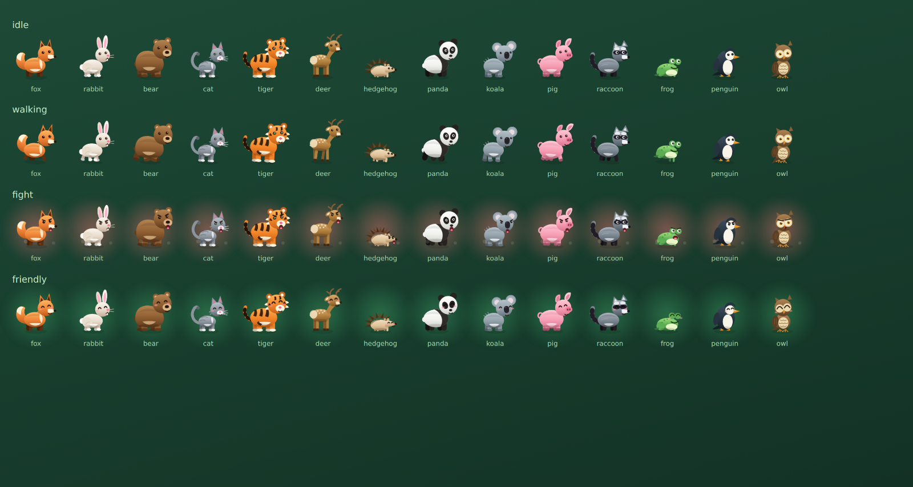

# Social-AnimaI-Icons

**▶️ [Live demo](https://mecca-research.github.io/Social-AnimaI-Icons/)** — runs entirely in your browser, no install required.


An interactive, emergent “living desktop” made of animal icons that socialize, argue, help each other, and roam a large map with stations for Food, Water, and Play. Every icon runs a tiny state machine (wander, idle, go-to-station, friendly, fight, flee, separate, cooldown, drag) and forms relationships via last-touch memory (friend or rival).

Current release: v0.9.1 — **Anatomy & animation polish.** Walk cycles now key off real on-screen movement (no more animals sliding with frozen legs — and they stop marching when paused), every body got a bespoke underbelly and back shading instead of the old uniform oval, the bear/panda/raccoon/owl/penguin/frog/hedgehog/deer received targeted anatomy fixes, birds walk like birds (penguin toddle, owl hop, feet that move with the legs), and the pond is now **twice the size** with a matching double-radius water zone — the forest's social hub. Built on v0.9: **every species is its own character.** Each of the 14 animals now has a bespoke silhouette and rig: legs are part of the body (hips tucked under the torso, far legs shaded for depth), birds get real bird bodies (a waddling tuxedo penguin, a disc‑faced owl with folded wings and talons), the frog gets a squat hop rig, and every species walks with its own stride and tempo (bears lumber, hedgehogs scurry). Spawning never repeats a species — the world starts with 8 unique animals and caps at 14, one of each.



✨ Features

Bespoke animal sprites — 14 hand‑drawn SVG characters, each with a unique silhouette and signature (fox's cream‑tipped brush tail, panda's eye patches and saddle, raccoon's bandit mask and ringed tail, deer's antlers and fawn spots, hedgehog's spike crown, koala's fluffy ears, tiger's bold stripes and cheek ruff, pig's snout and curly tail…). Rigged walk cycles with per‑species stride and tempo, idle breathing, double‑blinks, ear twitches, tail sway, and fight/friendly/flee faces. They face the way they move and cast a grounded shadow.

One of each — new animals spawn only as species not already in the world; the population caps at 14 (one per species). Try the sprite viewer at [`/?gallery=1`](https://mecca-research.github.io/Social-AnimaI-Icons/?gallery=1).

Richly textured forest 🌲 — a layered, painterly forest floor with volumetric god‑rays, depth, a fallen log, ferns, clover, flowers, mushrooms, pebbles, drifting leaves, fireflies, and fluttering butterflies.

Detailed animated stations — Water is a big reed‑fringed lily‑pad pond (doubled in size, with a doubled interaction zone to build richer waterside behavior on), Food a berry‑bush larder with a picnic basket and foraged nuts, Play a meadow with bunting, a bouncing ball, a spinning pinwheel and a kite.

A soft energy glow + floating emote signals each interaction (💢 fight · 💚 friendly · 💨 flee).

Large, responsive map with edge warp (touching the boundary warps icon to a random in-bounds spot and heads toward center).

Stations: Food · Water · Play (softly refill needs when nearby).

Social logic

At stations: ~60%/sec attempt to interact per nearby pair.

Play: 70% friendly / 30% fight

Food/Water: 40% friendly / 60% fight

In the wild (off stations): ~40%/sec attempt; 50/50 friendly vs fight.

Interaction lock: friendly or fight locks both icons in place for 8 seconds with vibration (bigger shake for fights).

Separation & cooldown: after locking, icons visibly peel apart (~1.4 s), then wander and cannot re-trigger events for ~4.2–7 s.

Ally assist: a nearby third icon whose last-touch with one fighter was friend will cause the opponent to flee briefly; allies cool down.

Last-touch relationships: each pair keeps only the last interaction tag (friend|rival); Inspector counts friends/enemies from that.

Controls: Pause/Run, Speed slider (decently slow → brisk), Add/Remove Icon (start 8 unique species, cap 14 — one of each), Reset World.

🧠 Behavior Model (quick reference)

Needs drain: slow; icons usually wander instead of camping at stations.

Intent mix: ≈ 67% wandering / 33% station-seeking (periodically re-rolled; intent forced to wander during cooldown).

Drag to intervene: grabbing an icon breaks an ongoing friendly/fight and triggers separation+cooldown.

🖥️ Tech Stack

React 18 + Vite (dev server & production bundler)

Tailwind CSS (compiled at build time, tree-shaken to the classes actually used)

Hand‑rigged SVG sprites & scene — pure inline SVG + CSS keyframe animation, no external image or sprite‑sheet assets

Deployed to GitHub Pages via "Deploy from a branch" — the built site is committed and served directly

The core UI is a single React component (`SocialAnimalsRPG`, in `app/src/SocialAnimalIcons.jsx`) you can drop into any app.

## 🌐 Live Demo & Deployment

**Live:** https://mecca-research.github.io/Social-AnimaI-Icons/

The site is a [Vite](https://vitejs.dev) build (React + Tailwind) published with **GitHub Pages → Deploy from a branch** — no Actions workflow and no build step on GitHub's side. The Vite source lives in [`app/`](app/); `npm run build` compiles it and publishes the result to **both the repo root and [`docs/`](docs/)**, each with a `.nojekyll` file. Because the build uses a relative asset base, the live site renders whether Pages serves the **`/ (root)`** folder or the **`/docs`** folder.

### One-time setup (repo owner)

**Settings → Pages → Build and deployment → Source: _Deploy from a branch_ → Branch: `main`.** Either folder — `/ (root)` or `/docs` — works, so no need to fuss over the folder dropdown. The site goes live at the URL above within a minute or two.

> The Vite `base` is `./` (relative), so hashed-asset URLs resolve from any served path, and the `.nojekyll` files tell Pages to serve the built files as-is (no Jekyll processing).

### Develop & publish

```bash
npm install
npm run dev      # start the Vite dev server (prints a localhost URL)
npm run build    # compile app/ and publish the build to the root + docs/
npm run preview  # preview the production build locally
```

Because Pages serves the committed build, **after changing the app run `npm run build` and commit the updated files** (the root build and `docs/`) for the live site to change. `app/src/` holds the simulation as a drop-in React component (`SocialAnimalIcons.jsx`, which exports `SocialAnimalsRPG`) plus the `App.jsx` and `main.jsx` entry files that mount it.
