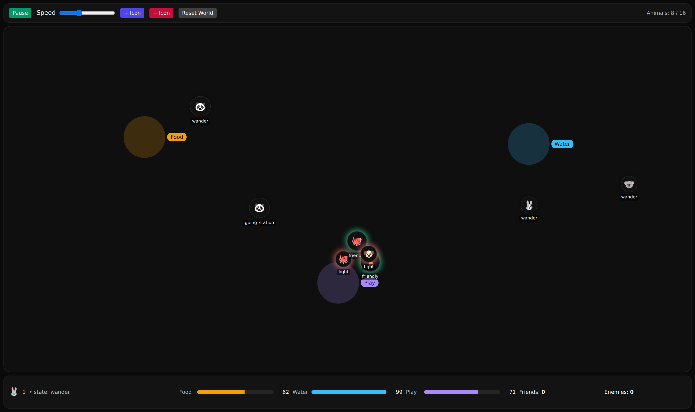

# Social-AnimaI-Icons

**▶️ [Live demo](https://mecca-research.github.io/Social-AnimaI-Icons/)** — runs entirely in your browser, no install required.



An interactive, emergent “living desktop” made of animal icons that socialize, argue, help each other, and roam a large map with stations for Food, Water, and Play. Every icon runs a tiny state machine (wander, idle, go-to-station, friendly, fight, flee, separate, cooldown, drag) and forms relationships via last-touch memory (friend or rival).

Current release: v0.6 — Locked interactions (8s), visible separation, enforced wander cooldown, ally-assist with forced flee, edge warp, big playfield, tuned speeds/needs.

✨ Features

Animal-only icons 🦊🐼🐧… with gentle idle waits and random direction changes.

Large, responsive map with edge warp (touching the boundary warps icon to a random in-bounds spot and heads toward center).

Stations: Food · Water · Play (softly refill needs when nearby).

Social logic

At stations: ~60%/sec attempt to interact per nearby pair.

Play: 70% friendly / 30% fight

Food/Water: 40% friendly / 60% fight

In the wild (off stations): ~40%/sec attempt; 50/50 friendly vs fight.

Interaction lock: friendly or fight locks both icons in place for 8 seconds with vibration (bigger shake for fights).

Separation & cooldown: after locking, icons visibly peel apart (~1.4 s), then wander and cannot re-trigger events for ~4.2–7 s.

Ally assist: a nearby third icon whose last-touch with one fighter was friend will cause the opponent to flee briefly; allies cool down.

Last-touch relationships: each pair keeps only the last interaction tag (friend|rival); Inspector counts friends/enemies from that.

Controls: Pause/Run, Speed slider (decently slow → brisk), Add/Remove Icon (start 8, cap 16), Reset World.

🧠 Behavior Model (quick reference)

Needs drain: slow; icons usually wander instead of camping at stations.

Intent mix: ≈ 67% wandering / 33% station-seeking (periodically re-rolled; intent forced to wander during cooldown).

Drag to intervene: grabbing an icon breaks an ongoing friendly/fight and triggers separation+cooldown.

🖥️ Tech Stack

React 18 + Vite (dev server & production bundler)

Tailwind CSS (compiled at build time, tree-shaken to the classes actually used)

Deployed to GitHub Pages via GitHub Actions on every push to `main`

The core UI is a single React component (`SocialAnimalsRPG`, in `src/SocialAnimalIcons.jsx`) you can drop into any app.

## 🌐 Live Demo & Deployment

**Live:** https://mecca-research.github.io/Social-AnimaI-Icons/

The site is a standard [Vite](https://vitejs.dev) build (React + Tailwind) published to **GitHub Pages via GitHub Actions**. Every push to `main` runs [`.github/workflows/deploy.yml`](.github/workflows/deploy.yml), which builds the app and deploys the `dist/` output. No build artifacts are committed — the root [`index.html`](index.html) is just the small Vite entry point, and the hashed JS/CSS bundles are generated during the build.

### One-time setup (repo owner)

Enable Pages to build from Actions: **Settings → Pages → Build and deployment → Source → _GitHub Actions_**. After that, the next push to `main` (or a manual run from the **Actions** tab) builds and deploys automatically, and the URL above goes live within a minute or two.

> The Vite `base` is set to `/Social-AnimaI-Icons/` in [`vite.config.js`](vite.config.js) so asset URLs resolve correctly under the project-pages path.

### Run locally

```bash
npm install
npm run dev      # start the dev server (prints a localhost URL)
npm run build    # production build into dist/
npm run preview  # serve the production build locally
```

`src/` holds the simulation as a drop-in React component (`SocialAnimalIcons.jsx`, which exports `SocialAnimalsRPG`) plus the `App.jsx` and `main.jsx` entry files that mount it.
