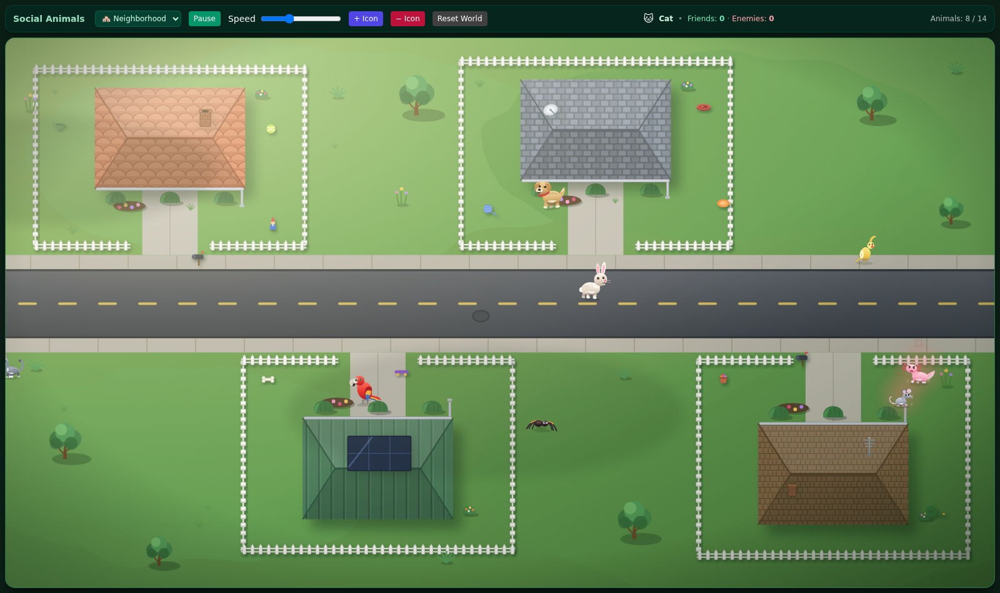
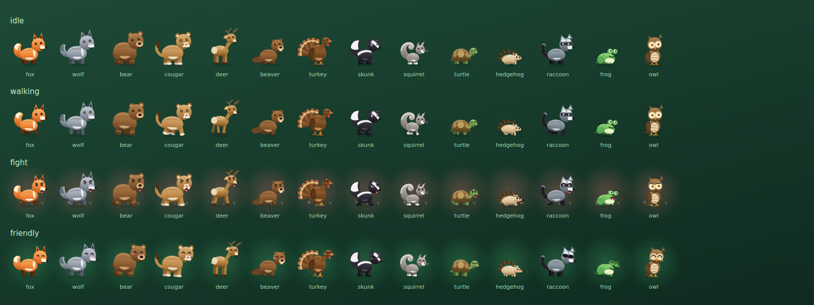

# Social-AnimaI-Icons

**▶️ [Live demo](https://mecca-research.github.io/Social-AnimaI-Icons/)** — runs entirely in your browser, no install required.


An interactive, emergent “living desktop” made of animal icons that socialize, argue, help each other, and roam **switchable worlds** — a forest around a lake, or a suburban neighborhood of rooftops. Every icon runs a tiny state machine (wander, idle, swim, friendly, fight, rescue, flee, separate, cooldown, drag) and forms relationships via last-touch memory (friend or rival).

Current release: v0.12 — **The Neighborhood.** A world picker now sits in the top bar: alongside the forest there's a **top‑down suburban block** — six hip‑roofed houses on a mow‑striped lawn, split by a street with sidewalks, driveways, yard trees, bushes, flower beds… and human/pet clutter lying around (tennis ball, dog bowl, bone, yarn, frisbee, garden gnome, watering can, skateboard, hose, flower pots, mailboxes). The rooftops are real obstacles — drawn from the same rectangles the physics uses — so animals only roam the grass, walkways and street, sliding around roof edges and never crossing them. No food or water sources here: it's all social. The cast is 14 pets: the **cat** and **rabbit** move out of the vault, joined by twelve newcomers in the same hand‑drawn style — a collared **Labrador**, slinky **ferret**, tricolor **guinea pig**, tiny **mouse**, spotted **gecko**, a legless **python** that actually slithers (body S‑wave, no stride), a scarlet **parrot**, an eight‑legged **tarantula** with banded knees scuttling on alternating leg pairs, a crested **cockatiel**, a huge‑eyed **sugar glider**, a strutting **pigeon**, and a smiling pink **axolotl**. Each has its own gait; encounters, avoidance and fight‑break‑up rescues all work the same in both worlds.



Built on v0.11 — **The lakeside world.** The pond grew into a proper **lake** (~6× the water) with an organic, bays‑and‑headlands shoreline, placed upper‑right with its south‑west shore reaching toward the middle of the map and a band of land kept along the top‑right corner. The same wobble‑ellipse drives both the artwork and the physics, so the drawn shoreline IS the collision boundary: land animals walk around the perimeter and never get wet, while the **beaver, frog and turtle spend ~40% of their time swimming** (the bear ~10%) — legs tucked, bobbing inside a ripple ring, splashing instead of kicking dust when they fight or make friends out on the water (and while in the lake they only interact with other swimmers). Social behavior deepened too: encounters now only trigger at true nose‑range, **bystanders clear away from fights**, and a **friend of a fighter sprints in to break the fight up** (the opponent flees). Map edges wrap smoothly — walk off one side, amble in from another; new animals enter the same way instead of popping in. The Food/Play stations, needs and meters are gone (the forest is scenery — more of it now in the upper clearings), the bottom bar is retired, and the selected animal with its Friends/Enemies count lives in the middle of the top bar.



✨ Features

Bespoke animal sprites — 14 hand‑drawn SVG forest natives, each with a unique silhouette and signature (fox's cream‑tipped brush tail, wolf's silver ruff and amber eyes, cougar's dark‑tipped rope tail, beaver's crosshatched paddle tail and buck teeth, turkey's banded fan and red snood, skunk's white blaze and raised plume, grey squirrel's giant frosted tail, turtle's scute‑tiled shell, deer's antlers and fawn spots, hedgehog's spike crown, raccoon's bandit mask…). Rigged walk cycles with per‑species stride and tempo, idle breathing, double‑blinks, ear twitches, tail sway, and fight/friendly/flee faces. They face the way they move and cast a grounded shadow.

One of each — new animals spawn only as species not already present; each world starts with 8 of its roster and caps at 14 (one per species). Try the sprite viewer at [`/?gallery=1`](https://mecca-research.github.io/Social-AnimaI-Icons/?gallery=1) — add [`&vault=1`](https://mecca-research.github.io/Social-AnimaI-Icons/?gallery=1&vault=1) to also see the reserved species kept for future worlds (jungle, down under, arctic, house pets, farm).

Richly textured forest 🌲 — a layered, painterly forest floor with volumetric god‑rays, depth, a fallen log, ferns, clover, flowers, mushrooms, pebbles, drifting leaves, fireflies, and fluttering butterflies.

The lake 🏞️ — a big reed‑fringed body of water with an organic shoreline (bays, headlands, lily pads, stepping stones, cattails, caustic light, drifting mist and a skimming dragonfly). One shared shape drives the art and the physics, so animals interact with exactly the shoreline you see.

Swimming — beaver, frog and turtle take dips ~40% of the time, the bear ~10%: legs tuck under the waterline, the sprite bobs inside a glowing ripple ring, and in‑water fights/friendships splash. Swimmers in the lake only interact with other swimmers; everyone else walks the perimeter.

A soft energy glow + floating emote signals each interaction (💢 fight · 💚 friendly · 💨 flee).

Large, responsive map with smooth edge wrap — walk off one side, amble back in from another; added animals also enter from an edge instead of appearing mid‑map.

Social logic

Encounters happen only at true nose‑range (~70–85 px), anywhere on the map: ~40%/sec attempt per close pair, 50/50 friendly vs fight.

Interaction lock: friendly or fight pulls the pair together nose‑to‑nose, facing each other, for 8 seconds of contact — synchronized nuzzling, lean‑ins and tail wags when friendly; alternating lunges, paw swipes and rearing when fighting (splashes for both when it happens in the lake).

Avoid confrontation: bystanders near an active fight steer away from it until it ends.

Break it up: a third animal whose last touch with one fighter was friendly sprints to the fight and breaks it up — the opponent flees, everyone involved cools down.

Separation & cooldown: after locking, icons visibly peel apart (~1.4 s), then wander and cannot re-trigger events for ~4.2–7 s.

Last-touch relationships: each pair keeps only the last interaction tag (friend|rival); the top bar counts friends/enemies from that.

Controls: Pause/Run, Speed slider (decently slow → brisk), Add/Remove Icon (start 8 unique species, cap 14 — one of each), Reset World. The selected animal (double‑click one) shows mid‑top‑bar with its Friends/Enemies tally.

🧠 Behavior Model (quick reference)

Intent mix: mostly wandering; swimmers periodically re-roll a “swim” intent (beaver/frog/turtle 40%, bear 10%) and paddle between spots inside the lake before coming ashore.

Drag to intervene: grabbing an icon breaks an ongoing friendly/fight and triggers separation+cooldown.

🖥️ Tech Stack

React 18 + Vite (dev server & production bundler)

Tailwind CSS (compiled at build time, tree-shaken to the classes actually used)

Hand‑rigged SVG sprites & scene — pure inline SVG + CSS keyframe animation, no external image or sprite‑sheet assets

Deployed to GitHub Pages via "Deploy from a branch" — the built site is committed and served directly

The core UI is a single React component (`SocialAnimalsRPG`, in `app/src/SocialAnimalIcons.jsx`) you can drop into any app.

## 🌐 Live Demo & Deployment

**Live:** https://mecca-research.github.io/Social-AnimaI-Icons/

The site is a [Vite](https://vitejs.dev) build (React + Tailwind) published with **GitHub Pages → Deploy from a branch** — no Actions workflow and no build step on GitHub's side. The Vite source lives in [`app/`](app/); `npm run build` compiles it and publishes the result to **both the repo root and [`docs/`](docs/)**, each with a `.nojekyll` file. Because the build uses a relative asset base, the live site renders whether Pages serves the **`/ (root)`** folder or the **`/docs`** folder.

### One-time setup (repo owner)

**Settings → Pages → Build and deployment → Source: _Deploy from a branch_ → Branch: `main`.** Either folder — `/ (root)` or `/docs` — works, so no need to fuss over the folder dropdown. The site goes live at the URL above within a minute or two.

> The Vite `base` is `./` (relative), so hashed-asset URLs resolve from any served path, and the `.nojekyll` files tell Pages to serve the built files as-is (no Jekyll processing).

### Develop & publish

```bash
npm install
npm run dev      # start the Vite dev server (prints a localhost URL)
npm run build    # compile app/ and publish the build to the root + docs/
npm run preview  # preview the production build locally
```

Because Pages serves the committed build, **after changing the app run `npm run build` and commit the updated files** (the root build and `docs/`) for the live site to change. `app/src/` holds the simulation as a drop-in React component (`SocialAnimalIcons.jsx`, which exports `SocialAnimalsRPG`) plus the `App.jsx` and `main.jsx` entry files that mount it.
